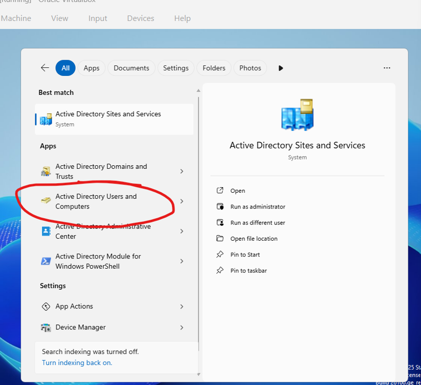
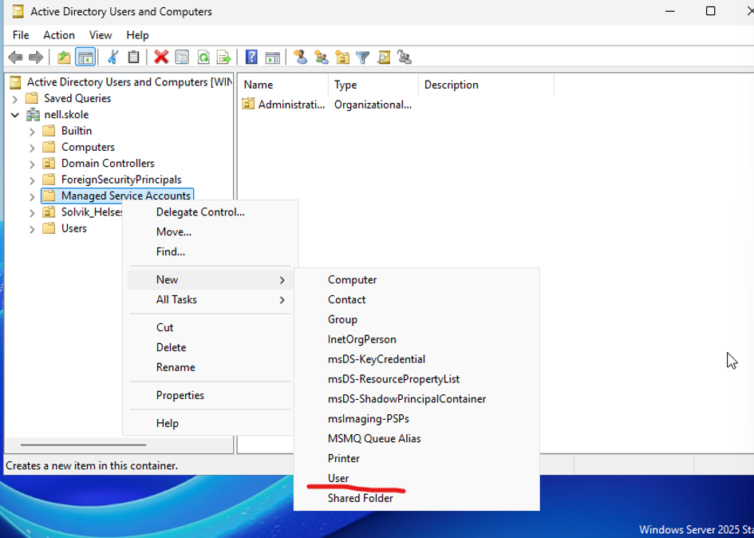
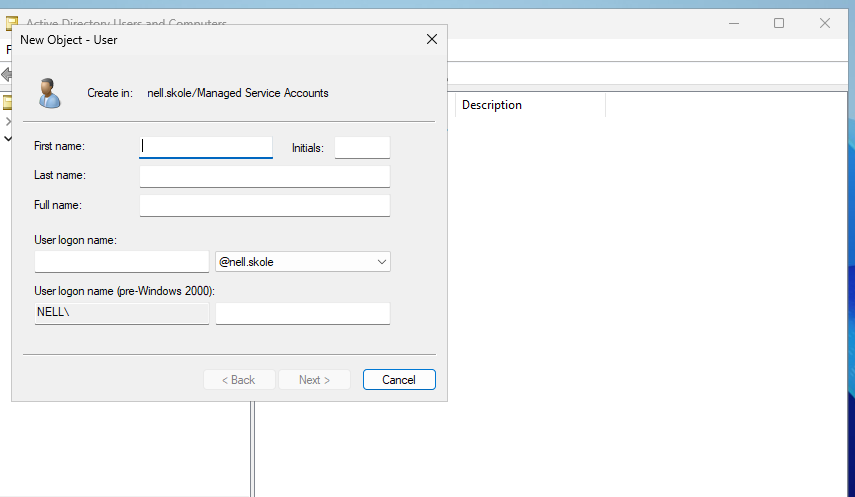

# Veileder for Active Directory
For å opprette en ny bruker i Active Directory må du først forsikre deg om at du er logget inn på Windows Server. Åpne deretter søkefeltet ved siden av programmene dine og skriv inn:
«Active Directory Users and Computers»

Du vil da se en liste over mapper som inneholder grupper og brukere som allerede finnes i systemet. Høyreklikk på mappen du vil legge brukeren til, velg «Ny» fra listen og klikk på «Bruker».

Du vil bli bedt om å oppgi opplysninger som fornavn, mellomnavn og brukernavn, som skal brukes til å logge deg på for å jobbe. Brukernavnet begynner vanligvis med den første delen av etternavnet ditt eller initialene dine.

Klikk på «Neste», hvor du blir bedt om å oppgi et nytt passord to ganger. Under dette har du muligheten til å velge «Brukeren må endre passord ved neste pålogging» hvis du ønsker at brukeren skal velge sitt eget passord.For å gjøre passordet ditt sikrere bør du bruke minst 8 tegn, inkludert både store og små bokstaver, og det bør ikke inneholde navnet ditt eller personopplysninger. Klikk på «Neste», så har du opprettet en ny bruker i Active Directory!

# Sette opp tilgang på mappe og filnivå
