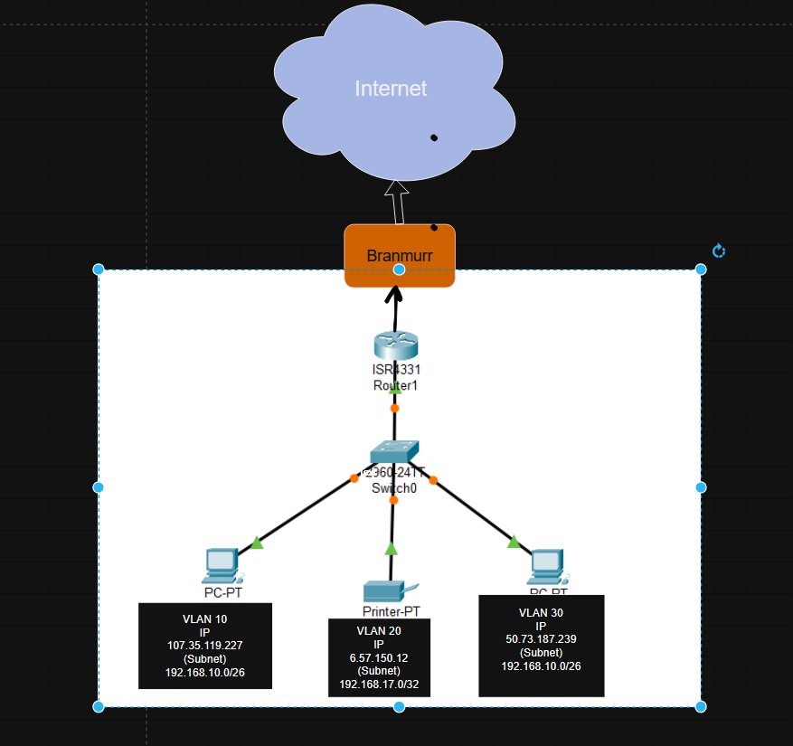

# Utvikling 

# Drift
Jeg prøvde først å bygge opp nettverket i Cisco Packet Tracer, men innså raskt at en enkel skisse ville være bedre for å visualisere oppgaven. For å vise et realistisk eksempel på hvordan dette kan brukes i bedriften, har jeg tatt med to datamaskiner og en skriver. Disse tre enhetene tilhører hvert sitt VLAN, noe som gjør at de ikke kan se hverandres trafikk. Alle enhetene er koblet til én felles switch, men på forskjellige porter ut fra hvilken avdeling de tilhører.
Nettverket har også en ruter som gir enhetene tilgang til internett, samt en brannmur som beskytter de ansatte på nett. Brannmuren sørger for at sensitive data ikke lekker ut, og hindrer tilgang til infiserte filer og nettsider med virus. Den kontrollerer rett og slett sikkerheten i nettverket, og så fort denne kontrollen er godkjent, slipper brukerne ut på internett.

